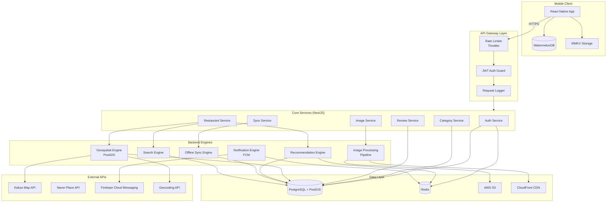
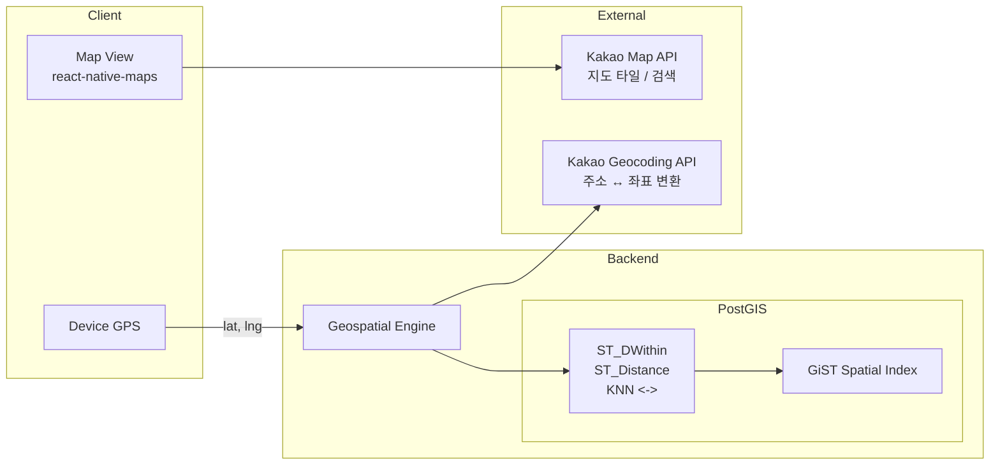
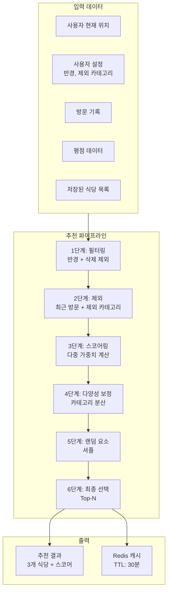
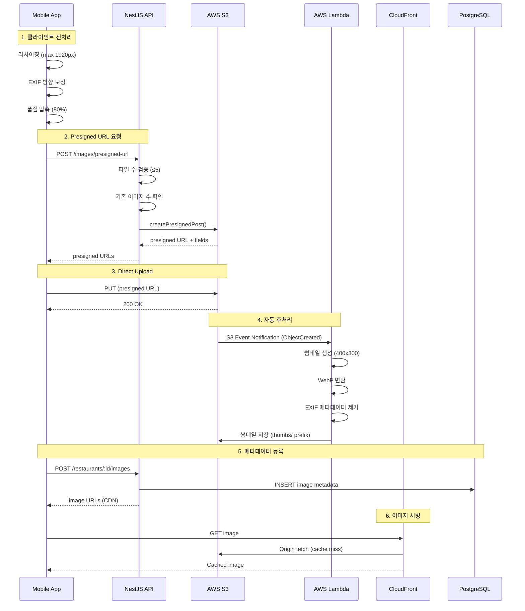
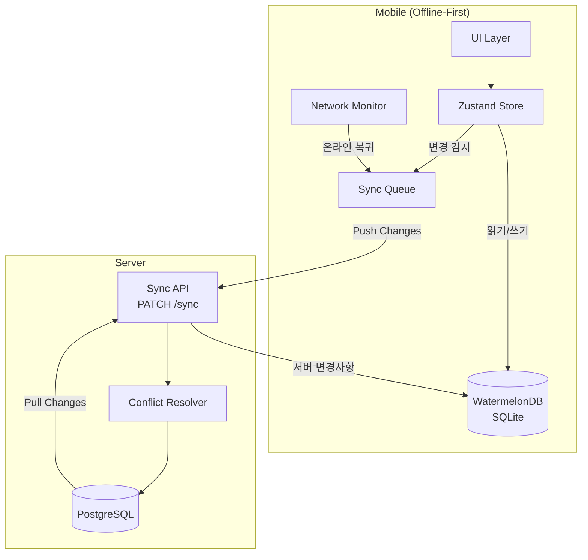
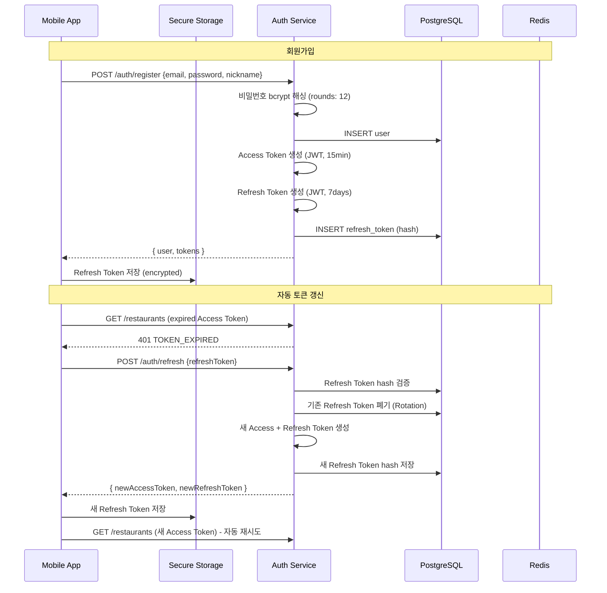
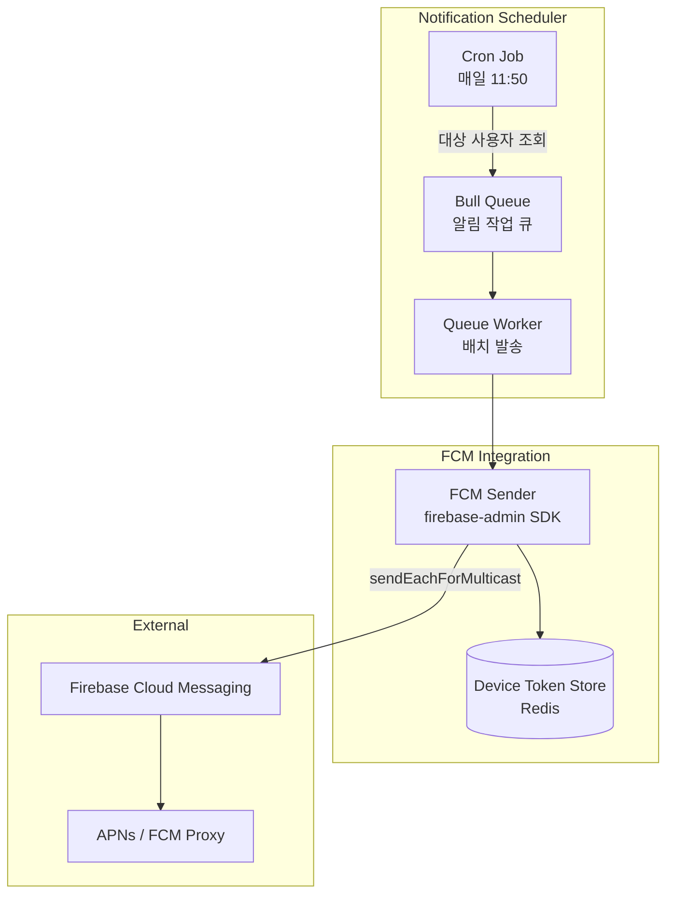
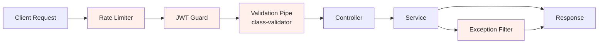
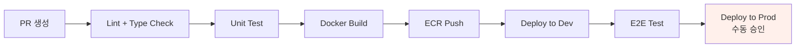
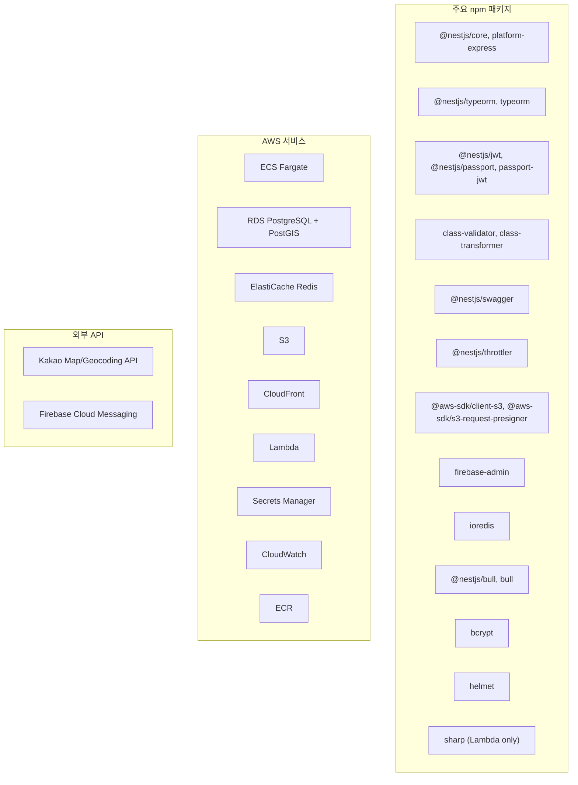

# Backend Implementation PRD: 맛집 저장 및 추천 앱

## 1. 개요

### 1.1 목적
이 문서는 맛집 저장 및 추천 앱의 **백엔드 시스템 전체를 구현하기 위한 기술 명세**를 정의한다.
서버 인프라, 위치 기반 서비스, 추천 엔진, 이미지 처리 파이프라인, 오프라인 동기화, 푸시 알림 등
앱이 동작하기 위해 필요한 모든 백엔드 엔진과 서비스를 다룬다.

### 1.2 시스템 전체 구성도



---

## 2. Geospatial Engine (위치 기반 서비스)

사용자의 실시간 위치를 기반으로 주변 맛집을 탐색하고, 거리 계산/정렬을 수행하는 핵심 엔진.

### 2.1 아키텍처



### 2.2 클라이언트 측 위치 수집

#### 사용 라이브러리

| 라이브러리 | 역할 |
|-----------|------|
| `expo-location` | GPS 위치 수집 (foreground) |
| `react-native-maps` | 지도 렌더링 (Kakao/Google Maps Provider) |

#### 위치 수집 전략

```typescript
// expo-location 설정
const LOCATION_CONFIG = {
  // 높은 정확도 (GPS + Wi-Fi + Cell)
  accuracy: Location.Accuracy.High,

  // 위치 업데이트 최소 간격
  timeInterval: 5000,       // 5초마다 업데이트
  distanceInterval: 50,     // 50m 이동 시 업데이트

  // 위치 요청 타임아웃
  timeout: 10000,           // 10초
};
```

#### 위치 권한 흐름

```
앱 최초 실행
  → 위치 권한 요청 팝업 (iOS: "앱 사용 중 허용" / Android: "정확한 위치")
  → 허용 시: GPS 기반 위치 수집 시작
  → 거부 시:
      → 추천 화면 진입 시 재요청 안내 바텀시트
      → "직접 위치 설정" 폴백 (주소 검색으로 좌표 지정)
      → 설정한 기본 위치(직장/집)가 있으면 해당 좌표 사용
```

#### 배터리 최적화

| 상태 | 전략 | 정확도 |
|------|------|--------|
| 추천 화면 활성 | High Accuracy, 5초 간격 | GPS |
| 앱 포그라운드 (비추천) | Balanced, 30초 간격 | Wi-Fi + Cell |
| 앱 백그라운드 | 위치 수집 중지 | - |
| 지도 뷰 활성 | High Accuracy, 3초 간격 | GPS |

### 2.3 서버 측 Geospatial Engine

#### PostGIS 설정

```sql
-- PostGIS 확장 활성화
CREATE EXTENSION IF NOT EXISTS postgis;

-- restaurants 테이블에 geography 컬럼 추가
ALTER TABLE restaurants
ADD COLUMN location geography(Point, 4326);

-- 좌표 데이터로 geography 컬럼 업데이트
UPDATE restaurants
SET location = ST_SetSRID(ST_MakePoint(longitude, latitude), 4326)::geography;

-- GiST 공간 인덱스 생성
CREATE INDEX idx_restaurants_location_gist
ON restaurants USING GIST (location);

-- 트리거: INSERT/UPDATE 시 location 자동 갱신
CREATE OR REPLACE FUNCTION update_restaurant_location()
RETURNS TRIGGER AS $$
BEGIN
    NEW.location = ST_SetSRID(ST_MakePoint(NEW.longitude, NEW.latitude), 4326)::geography;
    RETURN NEW;
END;
$$ LANGUAGE plpgsql;

CREATE TRIGGER trg_restaurant_location
BEFORE INSERT OR UPDATE OF latitude, longitude ON restaurants
FOR EACH ROW EXECUTE FUNCTION update_restaurant_location();
```

#### 핵심 쿼리

**반경 내 맛집 검색 (ST_DWithin)**

```sql
-- 사용자 위치(37.4979, 127.0276)에서 반경 1000m 이내 식당 조회
-- ST_DWithin은 GiST 인덱스를 활용하여 고성능 검색
SELECT
    r.id,
    r.name,
    r.address,
    r.rating,
    ST_Distance(r.location, ST_SetSRID(ST_MakePoint(:lng, :lat), 4326)::geography) AS distance_meters
FROM restaurants r
WHERE r.user_id = :userId
  AND r.deleted_at IS NULL
  AND ST_DWithin(
      r.location,
      ST_SetSRID(ST_MakePoint(:lng, :lat), 4326)::geography,
      :radiusMeters  -- 반경 (미터)
  )
ORDER BY distance_meters ASC;
```

**KNN 최근접 이웃 검색 (<-> 연산자)**

```sql
-- 가장 가까운 N개 식당 조회 (인덱스 기반, 매우 빠름)
SELECT
    r.id,
    r.name,
    r.location <-> ST_SetSRID(ST_MakePoint(:lng, :lat), 4326)::geography AS distance
FROM restaurants r
WHERE r.user_id = :userId
  AND r.deleted_at IS NULL
ORDER BY r.location <-> ST_SetSRID(ST_MakePoint(:lng, :lat), 4326)::geography
LIMIT :count;
```

#### 성능 기준

| 쿼리 | 데이터 규모 | 목표 응답 시간 |
|------|-----------|--------------|
| 반경 검색 (ST_DWithin) | 사용자당 500개 식당 | < 15ms |
| KNN 검색 (<->) | 사용자당 500개 식당 | < 8ms |
| 거리 계산 포함 정렬 | 사용자당 500개 식당 | < 20ms |

### 2.4 Geocoding (주소 ↔ 좌표 변환)

#### Kakao Geocoding API 연동

```typescript
// 주소 → 좌표 (Forward Geocoding)
interface GeocodeRequest {
  address: string;  // "서울 강남구 역삼동 123-45"
}

interface GeocodeResponse {
  latitude: number;   // 37.4979
  longitude: number;  // 127.0276
  roadAddress: string;
  jibunAddress: string;
}

// 좌표 → 주소 (Reverse Geocoding)
interface ReverseGeocodeRequest {
  latitude: number;
  longitude: number;
}
```

#### API 호출 전략

| 항목 | 전략 |
|------|------|
| Rate Limit | Kakao API 일 300,000회 (무료) |
| 캐싱 | 동일 주소 결과 Redis 캐시 (TTL: 30일) |
| 폴백 | Kakao 실패 시 Naver Geocoding API |
| 에러 처리 | 주소 변환 실패 시 사용자에게 지도 핀 수동 이동 유도 |

### 2.5 지도 서비스 (클라이언트)

#### Map Provider 선정: Kakao Map

| 기준 | Kakao Map | Google Maps | Naver Map |
|------|----------|-------------|-----------|
| 한국 내 정확도 | 매우 높음 | 높음 | 매우 높음 |
| React Native 지원 | WebView 기반 | react-native-maps 네이티브 | WebView 기반 |
| 무료 할당량 | 30만 회/일 | $200 크레딧/월 | 무료 제한적 |
| 장소 검색 API | 우수 (한국 최적화) | 글로벌 | 우수 |

**결정**: P0(MVP)에서는 `react-native-maps` (Google Maps Provider) 사용으로 네이티브 성능 확보.
장소 검색/Geocoding은 **Kakao API**를 사용하여 한국 내 정확도를 확보.
P1에서 Kakao Map SDK 네이티브 연동 검토.

```
지도 뷰 구성:
  - 기본: react-native-maps (Google Maps Provider)
  - 마커: 커스텀 마커 (카테고리 색상별)
  - 클러스터링: react-native-map-clustering (마커 50개 이상 시)
  - 현재 위치: 파란 점 + 정확도 원
  - 추천 반경: 반투명 원 오버레이
```

---

## 3. Recommendation Engine (추천 엔진)

사용자의 저장된 맛집 데이터와 위치, 방문 기록을 기반으로 점심 추천을 생성하는 엔진.

### 3.1 아키텍처



### 3.2 추천 알고리즘 상세 (v1 - Rule-Based)

MVP에서는 규칙 기반 추천을 사용한다. 사용자 데이터가 충분히 축적된 후(Phase 3)
협업 필터링(Collaborative Filtering) 기반으로 고도화한다.

#### 1단계: 후보 필터링

```sql
-- 반경 내 + 활성 상태 식당만 필터
SELECT r.*,
  ST_Distance(r.location, ST_SetSRID(ST_MakePoint(:lng, :lat), 4326)::geography) AS distance
FROM restaurants r
WHERE r.user_id = :userId
  AND r.deleted_at IS NULL
  AND ST_DWithin(r.location, ST_SetSRID(ST_MakePoint(:lng, :lat), 4326)::geography, :radius)
```

#### 2단계: 제외 로직

```typescript
interface ExclusionRules {
  // 최근 N일 내 방문한 식당 제외
  recentVisitDays: 3;

  // 사용자가 명시적으로 제외한 카테고리
  excludedCategoryIds: string[];
}
```

```sql
-- 최근 3일 내 방문 식당 제외
AND (r.last_visited_at IS NULL OR r.last_visited_at < NOW() - INTERVAL '3 days')

-- 제외 카테고리 필터
AND r.id NOT IN (
  SELECT rc.restaurant_id FROM restaurant_categories rc
  WHERE rc.category_id = ANY(:excludedCategoryIds)
)
```

#### 3단계: 스코어링

```typescript
interface ScoreWeights {
  rating: 0.30;        // 평점 가중치
  distance: 0.25;      // 거리 가중치 (가까울수록 높음)
  freshness: 0.20;     // 신선도 (오래 안 간 곳 우선)
  diversity: 0.15;     // 카테고리 다양성
  random: 0.10;        // 랜덤 요소 (탐색 촉진)
}

function calculateScore(restaurant, userContext): number {
  const scores = {
    // 평점: 5점 만점 정규화
    rating: (restaurant.rating || 3) / 5,

    // 거리: 반경 내에서 가까울수록 높음 (역정규화)
    distance: 1 - (restaurant.distance / userContext.radius),

    // 신선도: 마지막 방문으로부터 경과일 (최대 30일에서 cap)
    freshness: Math.min(daysSinceLastVisit / 30, 1.0),

    // 다양성: 최근 5회 방문 카테고리와 다르면 1.0, 같으면 0.3
    diversity: isNewCategory ? 1.0 : 0.3,

    // 랜덤: 0~1 균등 분포
    random: Math.random(),
  };

  return Object.entries(WEIGHTS).reduce(
    (total, [key, weight]) => total + scores[key] * weight, 0
  );
}
```

#### 4단계: 다양성 보정

```typescript
// 최종 Top-N 선택 시 같은 카테고리가 연속되지 않도록 보정
function diversifyResults(scored: ScoredRestaurant[], count: number): ScoredRestaurant[] {
  const result: ScoredRestaurant[] = [];
  const usedCategories = new Set<string>();

  // 1차: 스코어 상위에서 카테고리 중복 없이 선택
  for (const item of scored) {
    const primaryCategory = item.categories[0]?.id;
    if (!usedCategories.has(primaryCategory)) {
      result.push(item);
      usedCategories.add(primaryCategory);
    }
    if (result.length >= count) break;
  }

  // 부족하면 스코어 순으로 채움 (중복 허용)
  if (result.length < count) {
    for (const item of scored) {
      if (!result.includes(item)) {
        result.push(item);
      }
      if (result.length >= count) break;
    }
  }

  return result;
}
```

#### 5단계: "다른 추천 보기" 처리

```typescript
// "다른 추천"은 이전 추천을 제외하고 다음 Top-N을 반환
// Redis에 세션별 추천 히스토리 저장 (TTL: 2시간)
const cacheKey = `recommend:${userId}:${sessionId}`;

// 이전 추천 ID 목록 조회
const previousIds: string[] = await redis.smembers(cacheKey);

// 이전 추천 제외 후 새 추천 생성
const candidates = scored.filter(r => !previousIds.includes(r.id));

// 새 추천 ID를 히스토리에 추가
await redis.sadd(cacheKey, ...newRecommendations.map(r => r.id));
await redis.expire(cacheKey, 7200);
```

### 3.3 추천 캐시 전략

| 항목 | 값 | 이유 |
|------|-----|------|
| 캐시 키 | `recommend:{userId}:{lat}:{lng}:{radius}` | 위치/반경 변경 시 새 추천 |
| TTL | 30분 | 점심시간 내 변하지 않는 결과 보장 |
| 무효화 | 식당 저장/삭제/방문 기록 시 | 데이터 변경 즉시 반영 |
| 캐시 전략 | Cache-Aside | 캐시 미스 시 DB 조회 후 캐시 저장 |

### 3.4 추천 엔진 고도화 로드맵

| Phase | 알고리즘 | 설명 |
|-------|---------|------|
| **MVP (v1)** | Rule-Based Scoring | 가중치 기반 스코어링, 규칙 기반 필터링 |
| **v2** | 시간대/요일 패턴 | 점심/저녁, 평일/주말별 방문 패턴 분석 |
| **v3** | 협업 필터링 (CF) | 유사 사용자의 맛집 데이터 활용 (사용자 10K+ 이후) |

---

## 4. Image Processing Pipeline (이미지 처리)

### 4.1 전체 파이프라인



### 4.2 클라이언트 전처리

```typescript
// expo-image-manipulator 사용
const CLIENT_IMAGE_CONFIG = {
  // 리사이징: 긴 변 기준 최대 1920px
  maxDimension: 1920,

  // JPEG 압축 품질
  quality: 0.8,

  // 출력 포맷
  format: 'jpeg',
};

async function preprocessImage(uri: string): Promise<ProcessedImage> {
  // 1. 이미지 정보 조회
  const info = await getImageInfo(uri);

  // 2. 리사이징 (긴 변 1920px 초과 시)
  const resized = await ImageManipulator.manipulateAsync(
    uri,
    [{ resize: { width: Math.min(info.width, 1920) } }],
    { compress: 0.8, format: SaveFormat.JPEG }
  );

  // 3. 파일 크기 확인 (10MB 초과 시 추가 압축)
  if (resized.fileSize > 10 * 1024 * 1024) {
    throw new ImageTooLargeError();
  }

  return resized;
}
```

### 4.3 S3 Presigned URL 생성

```typescript
// NestJS Image Service
@Injectable()
export class ImageService {
  async createPresignedUrls(
    userId: string,
    restaurantId: string,
    files: FileMetadata[],
  ): Promise<PresignedUrlResponse[]> {

    // 1. 기존 이미지 수 확인
    const existingCount = await this.imageRepo.count({
      where: { restaurantId, userId },
    });

    if (existingCount + files.length > 5) {
      throw new UnprocessableEntityException('MAX_IMAGES_EXCEEDED');
    }

    // 2. 각 파일에 대해 presigned URL 생성
    return Promise.all(files.map(async (file) => {
      const s3Key = `images/${userId}/${restaurantId}/${Date.now()}-${uuid()}.jpg`;

      const command = new PutObjectCommand({
        Bucket: this.configService.get('AWS_S3_BUCKET'),
        Key: s3Key,
        ContentType: file.mimeType,
        // 업로드 제약 조건
        Metadata: {
          'user-id': userId,
          'restaurant-id': restaurantId,
        },
      });

      const uploadUrl = await getSignedUrl(this.s3Client, command, {
        expiresIn: 300, // 5분
      });

      return { fileName: file.fileName, s3Key, uploadUrl, expiresIn: 300 };
    }));
  }
}
```

### 4.4 Lambda 후처리 (썸네일 생성)

```typescript
// AWS Lambda - S3 트리거
export const handler = async (event: S3Event) => {
  for (const record of event.Records) {
    const bucket = record.s3.bucket.name;
    const key = decodeURIComponent(record.s3.object.key);

    // images/ prefix만 처리 (thumbs/ 재귀 방지)
    if (!key.startsWith('images/')) return;

    // 1. 원본 이미지 가져오기
    const original = await s3.getObject({ Bucket: bucket, Key: key });

    // 2. Sharp로 썸네일 생성
    const thumbnail = await sharp(original.Body)
      .resize(400, 300, { fit: 'cover' })
      .webp({ quality: 75 })
      .toBuffer();

    // 3. EXIF 메타데이터 제거된 원본 (WebP)
    const optimized = await sharp(original.Body)
      .rotate() // EXIF 방향 보정
      .webp({ quality: 85 })
      .toBuffer();

    // 4. 저장
    const thumbKey = key.replace('images/', 'thumbs/').replace(/\.\w+$/, '.webp');
    const optimizedKey = key.replace(/\.\w+$/, '.webp');

    await Promise.all([
      s3.putObject({ Bucket: bucket, Key: thumbKey, Body: thumbnail, ContentType: 'image/webp' }),
      s3.putObject({ Bucket: bucket, Key: optimizedKey, Body: optimized, ContentType: 'image/webp' }),
    ]);
  }
};
```

### 4.5 S3 버킷 구조

```
matjip-images/
├── images/                          # 원본 이미지 (WebP 변환)
│   └── {userId}/
│       └── {restaurantId}/
│           └── {timestamp}-{uuid}.webp
├── thumbs/                          # 썸네일 (400x300)
│   └── {userId}/
│       └── {restaurantId}/
│           └── {timestamp}-{uuid}.webp
└── profiles/                        # 프로필 이미지
    └── {userId}/
        └── profile.webp
```

### 4.6 CDN 설정 (CloudFront)

| 설정 | 값 |
|------|-----|
| Origin | matjip-images S3 Bucket |
| Cache Policy | TTL 30일 (이미지는 불변, 삭제 시 S3 객체 삭제) |
| Price Class | PriceClass_200 (아시아 포함) |
| Allowed Methods | GET, HEAD |
| Compress | Yes (WebP는 이미 압축이므로 효과 미미) |
| Custom Domain | cdn.matjip.app |

### 4.7 이미지 삭제 처리

```typescript
async deleteImage(userId: string, imageId: string): Promise<void> {
  const image = await this.imageRepo.findOne({
    where: { id: imageId, userId },
  });

  if (!image) throw new NotFoundException('IMAGE_NOT_FOUND');

  // 1. S3 객체 삭제 (원본 + 썸네일)
  await Promise.all([
    this.s3.deleteObject({ Bucket: BUCKET, Key: image.s3Key }),
    this.s3.deleteObject({ Bucket: BUCKET, Key: image.s3Key.replace('images/', 'thumbs/') }),
  ]);

  // 2. DB 레코드 삭제 (Hard Delete)
  await this.imageRepo.remove(image);

  // 3. CloudFront 캐시 무효화 (선택적, 비용 발생)
  // 삭제된 이미지 접근 시 S3에서 404 반환하므로 즉시 무효화 불필요
}
```

---

## 5. Offline Sync Engine (오프라인 동기화)

### 5.1 아키텍처



### 5.2 WatermelonDB 스키마

```typescript
// apps/mobile/src/db/schema.ts
import { appSchema, tableSchema } from '@nozbe/watermelondb';

export const schema = appSchema({
  version: 1,
  tables: [
    tableSchema({
      name: 'restaurants',
      columns: [
        { name: 'server_id', type: 'string', isOptional: true },
        { name: 'name', type: 'string' },
        { name: 'address', type: 'string' },
        { name: 'latitude', type: 'number' },
        { name: 'longitude', type: 'number' },
        { name: 'phone', type: 'string', isOptional: true },
        { name: 'memo', type: 'string', isOptional: true },
        { name: 'rating', type: 'number', isOptional: true },
        { name: 'last_visited_at', type: 'number', isOptional: true },
        { name: 'created_at', type: 'number' },
        { name: 'updated_at', type: 'number' },
      ],
    }),
    tableSchema({
      name: 'categories',
      columns: [
        { name: 'server_id', type: 'string', isOptional: true },
        { name: 'name', type: 'string' },
        { name: 'color_hex', type: 'string' },
        { name: 'sort_order', type: 'number' },
      ],
    }),
    tableSchema({
      name: 'reviews',
      columns: [
        { name: 'server_id', type: 'string', isOptional: true },
        { name: 'restaurant_id', type: 'string' },
        { name: 'content', type: 'string' },
        { name: 'rating', type: 'number' },
        { name: 'visited_date', type: 'string', isOptional: true },
        { name: 'created_at', type: 'number' },
        { name: 'updated_at', type: 'number' },
      ],
    }),
  ],
});
```

### 5.3 동기화 프로토콜

```typescript
// 동기화 흐름 (WatermelonDB synchronize 활용)
import { synchronize } from '@nozbe/watermelondb/sync';

async function syncWithServer() {
  await synchronize({
    database,

    // 1. Pull: 서버에서 변경사항 가져오기
    pullChanges: async ({ lastPulledAt }) => {
      const response = await api.get('/sync/pull', {
        params: { lastPulledAt },
      });

      return {
        changes: response.data.changes,
        timestamp: response.data.timestamp,
      };
    },

    // 2. Push: 로컬 변경사항 서버에 보내기
    pushChanges: async ({ changes, lastPulledAt }) => {
      await api.post('/sync/push', {
        changes,
        lastPulledAt,
      });
    },

    // 3. 마이그레이션 (스키마 변경 시)
    migrationsEnabledAtVersion: 1,
  });
}
```

### 5.4 충돌 해결 (Conflict Resolution)

```typescript
// 서버 측 충돌 해결 전략
@Injectable()
export class SyncService {

  /**
   * 충돌 해결 전략: Per-Column Client-Wins
   *
   * 서버와 클라이언트 모두 변경된 레코드가 있을 때:
   * - 기본: 서버 버전을 기반으로 함
   * - 클라이언트가 마지막 sync 이후 변경한 컬럼만 클라이언트 값 적용
   *
   * 예시:
   *   서버: { name: "식당A(수정)", rating: 4 }
   *   클라이언트: { name: "식당A", rating: 5 }  (rating만 변경)
   *   결과: { name: "식당A(수정)", rating: 5 }   (서버 name + 클라이언트 rating)
   */
  resolveConflict(serverRecord: any, clientRecord: any, clientChangedColumns: string[]): any {
    const resolved = { ...serverRecord };

    for (const column of clientChangedColumns) {
      resolved[column] = clientRecord[column];
    }

    resolved.updated_at = new Date();
    return resolved;
  }
}
```

### 5.5 동기화 트리거 조건

| 트리거 | 동작 |
|--------|------|
| 앱 포그라운드 진입 | 자동 Pull (서버 변경사항 가져오기) |
| 네트워크 온라인 복귀 | 자동 Push + Pull (양방향 동기화) |
| 데이터 변경 후 5초 | Debounced Push (로컬 변경 업로드) |
| 수동 Pull-to-Refresh | 강제 전체 동기화 |
| 앱 백그라운드 진입 | 대기 중인 Push 즉시 실행 |

### 5.6 오프라인 시 기능 제한

| 기능 | 오프라인 지원 | 동작 |
|------|-------------|------|
| 식당 목록 조회 | O | WatermelonDB에서 로컬 데이터 조회 |
| 식당 상세 조회 | O | 로컬 데이터 (이미지는 캐시된 것만) |
| 식당 추가/수정 | O | 로컬 저장 후 온라인 시 동기화 |
| 리뷰 작성 | O | 로컬 저장 후 동기화 |
| 카테고리 관리 | O | 로컬 저장 후 동기화 |
| 이미지 업로드 | X | 온라인 필요 (큐에 저장, 온라인 시 업로드) |
| 추천 | 부분 | 마지막 캐시 결과 표시, 새 추천 불가 |
| 검색 | O | 로컬 DB 내 검색 |
| 지도 | 부분 | 캐시된 타일만, 새 영역 로딩 불가 |

---

## 6. Authentication Engine (인증 엔진)

### 6.1 인증 흐름



### 6.2 JWT 구조

```typescript
// Access Token Payload
interface AccessTokenPayload {
  sub: string;       // userId (UUID)
  email: string;
  type: 'access';
  iat: number;       // 발급 시간
  exp: number;       // 만료 시간 (15분)
}

// Refresh Token Payload
interface RefreshTokenPayload {
  sub: string;       // userId
  jti: string;       // 토큰 고유 ID (revocation 추적용)
  type: 'refresh';
  iat: number;
  exp: number;       // 만료 시간 (7일)
}
```

### 6.3 보안 설정

| 항목 | 설정 | 이유 |
|------|------|------|
| Access Token 만료 | 15분 | 탈취 시 피해 최소화 |
| Refresh Token 만료 | 7일 | 주 1회 이상 앱 사용 사용자 편의 |
| Refresh Token Rotation | 사용할 때마다 새 토큰 발급 | 탈취된 Refresh Token 무효화 |
| Refresh Token 저장 | MMKV (암호화) | Keychain/Keystore 수준 보안 |
| 비밀번호 해싱 | bcrypt (rounds: 12) | brute force 방어 |
| Rate Limiting (로그인) | 5회/분 (IP 기준) | 무차별 대입 방어 |
| Rate Limiting (회원가입) | 3회/시간 (IP 기준) | 스팸 계정 방지 |

### 6.4 클라이언트 Axios 인터셉터

```typescript
// 토큰 자동 갱신 인터셉터
api.interceptors.response.use(
  (response) => response,
  async (error) => {
    const originalRequest = error.config;

    if (error.response?.status === 401
        && error.response?.data?.error?.code === 'TOKEN_EXPIRED'
        && !originalRequest._retry) {

      originalRequest._retry = true;

      try {
        const refreshToken = await getRefreshToken(); // MMKV에서 조회
        const { data } = await api.post('/auth/refresh', { refreshToken });

        // 새 토큰 저장
        setAccessToken(data.accessToken);
        await setRefreshToken(data.refreshToken); // MMKV

        // 실패한 요청 재시도
        originalRequest.headers.Authorization = `Bearer ${data.accessToken}`;
        return api(originalRequest);

      } catch (refreshError) {
        // Refresh 실패 → 로그아웃 처리
        await logout();
        return Promise.reject(refreshError);
      }
    }

    return Promise.reject(error);
  }
);
```

---

## 7. Notification Engine (푸시 알림)

### 7.1 아키텍처



### 7.2 알림 유형

| 유형 | 트리거 | 시간 | 내용 예시 |
|------|--------|------|----------|
| 점심 추천 | Cron (매일 11:50) | 11:50 | "오늘 점심 뭐 먹을까요? 추천받아 보세요 🍽" |
| 저녁 추천 | Cron (매금 17:30) | 17:30 (금요일만) | "금요일 저녁, 특별한 맛집 어때요?" |
| 오래 안 간 맛집 | Cron (매주 월 09:00) | 월 09:00 | "'{식당명}' 방문한 지 30일이 넘었어요" |

### 7.3 FCM Device Token 관리

```typescript
@Injectable()
export class NotificationService {

  // 디바이스 토큰 등록/갱신
  async registerDeviceToken(userId: string, token: string, platform: 'ios' | 'android') {
    const key = `fcm:token:${userId}`;

    await this.redis.hset(key, {
      token,
      platform,
      updatedAt: Date.now().toString(),
    });
  }

  // 비활성 토큰 정리 (FCM 응답에서 invalid token 감지 시)
  async removeInvalidToken(userId: string) {
    await this.redis.del(`fcm:token:${userId}`);
  }
}
```

### 7.4 점심 추천 알림 발송

```typescript
@Injectable()
export class LunchNotificationJob {

  // 매일 11:50 실행
  @Cron('50 11 * * *', { timeZone: 'Asia/Seoul' })
  async sendLunchRecommendations() {

    // 1. 알림 수신 동의한 사용자 조회 (배치)
    const users = await this.userRepo.find({
      where: { lunchNotificationEnabled: true },
    });

    // 2. Bull Queue에 작업 추가 (Rate Limiting 준수)
    for (const batch of chunk(users, 500)) {
      await this.notificationQueue.add('lunch-recommend', {
        userIds: batch.map(u => u.id),
      }, {
        // FCM Rate Limit 방지: 배치 간 1초 간격
        delay: batch.index * 1000,
      });
    }
  }

  // Queue Worker
  async processLunchNotification(job: Job) {
    const { userIds } = job.data;

    for (const userId of userIds) {
      const tokenData = await this.redis.hgetall(`fcm:token:${userId}`);
      if (!tokenData.token) continue;

      await this.fcm.send({
        token: tokenData.token,
        notification: {
          title: '오늘 점심 뭐 먹을까요?',
          body: '저장한 맛집 중에서 추천받아 보세요',
        },
        data: {
          type: 'LUNCH_RECOMMEND',
          deepLink: 'matjip://recommend',
        },
        android: {
          priority: 'normal', // 배터리 최적화
          notification: { channelId: 'lunch-recommend' },
        },
        apns: {
          payload: { aps: { sound: 'default' } },
        },
      });
    }
  }
}
```

### 7.5 사용자 알림 설정

```typescript
interface NotificationPreferences {
  lunchNotificationEnabled: boolean;   // 점심 추천 알림 (기본: true)
  eveningNotificationEnabled: boolean; // 저녁 추천 알림 (기본: false)
  reminderEnabled: boolean;            // 오래 안 간 맛집 리마인더 (기본: true)
}
```

---

## 8. Search Engine (검색 엔진)

### 8.1 검색 전략

MVP에서는 PostgreSQL 내장 기능으로 검색을 구현한다.
사용자 규모 확대 시(10K+) Elasticsearch 도입을 검토한다.

### 8.2 한글 검색 (Full-Text Search)

```sql
-- 한글 검색을 위한 pg_trgm 확장
CREATE EXTENSION IF NOT EXISTS pg_trgm;

-- 트라이그램 인덱스 생성
CREATE INDEX idx_restaurants_name_trgm
ON restaurants USING GIN (name gin_trgm_ops);

CREATE INDEX idx_restaurants_address_trgm
ON restaurants USING GIN (address gin_trgm_ops);

-- 검색 쿼리 (유사도 기반)
SELECT
    r.id,
    r.name,
    r.address,
    similarity(r.name, :query) AS name_score,
    similarity(r.address, :query) AS address_score
FROM restaurants r
WHERE r.user_id = :userId
  AND r.deleted_at IS NULL
  AND (
    r.name % :query          -- 트라이그램 유사도 (기본 임계값 0.3)
    OR r.address % :query
  )
ORDER BY GREATEST(similarity(r.name, :query), similarity(r.address, :query)) DESC
LIMIT 20;
```

### 8.3 자동완성 (Typeahead)

```typescript
// 클라이언트: 300ms debounce 후 검색 요청
// 서버: LIKE 기반 prefix 검색 (인덱스 활용)

async searchTypeahead(userId: string, query: string): Promise<string[]> {
  if (query.length < 2) return [];

  const results = await this.restaurantRepo
    .createQueryBuilder('r')
    .select('DISTINCT r.name')
    .where('r.user_id = :userId', { userId })
    .andWhere('r.deleted_at IS NULL')
    .andWhere('r.name ILIKE :query', { query: `${query}%` })
    .orderBy('r.name')
    .limit(5)
    .getRawMany();

  return results.map(r => r.name);
}
```

### 8.4 검색 성능 기준

| 쿼리 유형 | 데이터 규모 | 목표 |
|-----------|-----------|------|
| 자동완성 (prefix) | 사용자당 500개 | < 30ms |
| 유사도 검색 (trigram) | 사용자당 500개 | < 50ms |
| 복합 필터 (카테고리+평점+검색어) | 사용자당 500개 | < 80ms |

---

## 9. API Gateway & Security

### 9.1 Rate Limiting

```typescript
// NestJS Throttler 설정
@Module({
  imports: [
    ThrottlerModule.forRoot([
      {
        name: 'short',
        ttl: 1000,    // 1초
        limit: 10,    // 초당 10회
      },
      {
        name: 'medium',
        ttl: 60000,   // 1분
        limit: 100,   // 분당 100회
      },
      {
        name: 'long',
        ttl: 3600000, // 1시간
        limit: 1000,  // 시간당 1000회
      },
    ]),
  ],
})
export class AppModule {}

// 엔드포인트별 커스텀 제한
@Controller('auth')
export class AuthController {

  @Post('login')
  @Throttle({ short: { limit: 5, ttl: 60000 } }) // 분당 5회
  async login() {}

  @Post('register')
  @Throttle({ short: { limit: 3, ttl: 3600000 } }) // 시간당 3회
  async register() {}
}
```

### 9.2 Request Validation Pipeline



### 9.3 Global Exception Filter

```typescript
@Catch()
export class GlobalExceptionFilter implements ExceptionFilter {
  catch(exception: unknown, host: ArgumentsHost) {
    const ctx = host.switchToHttp();
    const response = ctx.getResponse<Response>();

    let status = 500;
    let errorCode = 'INTERNAL_SERVER_ERROR';
    let message = 'An unexpected error occurred';

    if (exception instanceof HttpException) {
      status = exception.getStatus();
      const exResponse = exception.getResponse();
      errorCode = typeof exResponse === 'string' ? exResponse : (exResponse as any).message;
      message = errorCode;
    }

    // 구조화된 에러 로깅
    this.logger.error({
      statusCode: status,
      errorCode,
      message,
      path: ctx.getRequest().url,
      timestamp: new Date().toISOString(),
    });

    response.status(status).json({
      success: false,
      error: {
        code: errorCode,
        message,
        statusCode: status,
      },
    });
  }
}
```

### 9.4 CORS & Security Headers

```typescript
// main.ts
async function bootstrap() {
  const app = await NestFactory.create(AppModule);

  // CORS
  app.enableCors({
    origin: [
      'http://localhost:8081',            // Expo dev
      'https://matjip.app',               // Production
    ],
    credentials: true,
  });

  // Helmet (Security Headers)
  app.use(helmet({
    contentSecurityPolicy: false, // API 서버이므로 CSP 불필요
  }));

  // Request size limit (이미지는 S3 직접 업로드)
  app.use(json({ limit: '1mb' }));

  // Global pipes
  app.useGlobalPipes(new ValidationPipe({
    whitelist: true,           // DTO에 없는 필드 자동 제거
    forbidNonWhitelisted: true, // 알 수 없는 필드 시 400 에러
    transform: true,           // 자동 타입 변환
  }));

  await app.listen(3000);
}
```

---

## 10. Monitoring & Logging

### 10.1 로깅 구조

```typescript
// 구조화된 로그 (JSON 형태로 CloudWatch에 전송)
interface LogEntry {
  level: 'info' | 'warn' | 'error';
  message: string;
  context: string;          // 모듈명 (RestaurantService 등)
  requestId: string;        // 요청 추적용 UUID
  userId?: string;
  method: string;           // HTTP Method
  path: string;             // 요청 경로
  statusCode: number;
  responseTime: number;     // ms
  timestamp: string;        // ISO 8601
  error?: {
    name: string;
    message: string;
    stack: string;
  };
}
```

### 10.2 모니터링 대시보드 (CloudWatch)

| 메트릭 | 알람 조건 | 알림 채널 |
|--------|----------|----------|
| API 응답 시간 (p95) | > 500ms (5분 지속) | Slack |
| API 에러율 (5xx) | > 1% (5분 지속) | Slack + PagerDuty |
| DB 커넥션 수 | > 80% of max | Slack |
| Redis 메모리 | > 80% | Slack |
| S3 에러율 | > 0.5% | Slack |
| ECS CPU 사용률 | > 70% (10분 지속) | Slack |
| ECS 메모리 사용률 | > 80% | Slack |

### 10.3 Health Check

```typescript
@Controller('health')
export class HealthController {
  constructor(
    private health: HealthCheckService,
    private db: TypeOrmHealthIndicator,
    private redis: RedisHealthIndicator,
  ) {}

  @Get()
  check() {
    return this.health.check([
      () => this.db.pingCheck('database'),
      () => this.redis.pingCheck('redis'),
    ]);
  }
}

// ALB Health Check: GET /health → 200 OK
// Interval: 30s, Timeout: 5s, Unhealthy threshold: 3
```

---

## 11. Infrastructure & Deployment

### 11.1 환경 구성

| 환경 | 용도 | 인프라 |
|------|------|--------|
| **local** | 개발자 로컬 | Docker Compose (PostgreSQL + Redis) |
| **dev** | 개발/테스트 | ECS 1 task, RDS t3.micro, ElastiCache t3.micro |
| **prod** | 프로덕션 | ECS 2+ tasks, RDS t3.small (Multi-AZ), ElastiCache t3.small |

### 11.2 Docker Compose (로컬 개발)

```yaml
# apps/api/docker-compose.yml
version: '3.8'

services:
  postgres:
    image: postgis/postgis:16-3.4
    ports:
      - '5432:5432'
    environment:
      POSTGRES_DB: matjip
      POSTGRES_USER: matjip
      POSTGRES_PASSWORD: matjip_local
    volumes:
      - pgdata:/var/lib/postgresql/data

  redis:
    image: redis:7-alpine
    ports:
      - '6379:6379'

volumes:
  pgdata:
```

### 11.3 CI/CD Pipeline



### 11.4 ECS Task Definition (프로덕션)

```json
{
  "family": "matjip-api",
  "cpu": "256",
  "memory": "512",
  "networkMode": "awsvpc",
  "containerDefinitions": [
    {
      "name": "api",
      "image": "{ECR_URI}:latest",
      "portMappings": [{ "containerPort": 3000 }],
      "environment": [
        { "name": "NODE_ENV", "value": "production" },
        { "name": "PORT", "value": "3000" }
      ],
      "secrets": [
        { "name": "DATABASE_URL", "valueFrom": "arn:aws:secretsmanager:..." },
        { "name": "JWT_ACCESS_SECRET", "valueFrom": "arn:aws:secretsmanager:..." },
        { "name": "JWT_REFRESH_SECRET", "valueFrom": "arn:aws:secretsmanager:..." }
      ],
      "logConfiguration": {
        "logDriver": "awslogs",
        "options": {
          "awslogs-group": "/ecs/matjip-api",
          "awslogs-region": "ap-northeast-2",
          "awslogs-stream-prefix": "api"
        }
      },
      "healthCheck": {
        "command": ["CMD-SHELL", "curl -f http://localhost:3000/health || exit 1"],
        "interval": 30,
        "timeout": 5,
        "retries": 3
      }
    }
  ]
}
```

---

## 12. 엔진별 의존성 요약



| 엔진 | 핵심 의존성 | 외부 서비스 |
|------|-----------|-----------|
| Geospatial | PostGIS, TypeORM | Kakao Geocoding API |
| Recommendation | PostgreSQL, ioredis | - |
| Image Pipeline | @aws-sdk/client-s3, sharp | S3, Lambda, CloudFront |
| Offline Sync | TypeORM, WatermelonDB (client) | - |
| Authentication | @nestjs/jwt, bcrypt, ioredis | - |
| Notification | firebase-admin, bull, ioredis | Firebase Cloud Messaging |
| Search | PostgreSQL pg_trgm | - |
| Monitoring | @nestjs/terminus | CloudWatch |
