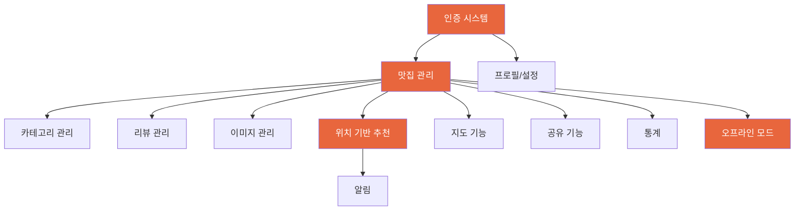

# 기능 명세서: 맛집 저장 및 추천 앱

## 1. 기능 전체 맵

```
맛집 앱
├── 1. 인증 시스템
│   ├── 회원가입
│   ├── 로그인 / 자동 로그인
│   ├── 로그아웃
│   └── 비밀번호 재설정
│
├── 2. 맛집 관리 (핵심)
│   ├── 맛집 추가
│   ├── 맛집 목록 조회
│   ├── 맛집 상세 조회
│   ├── 맛집 수정
│   ├── 맛집 삭제
│   └── 맛집 검색 / 필터 / 정렬
│
├── 3. 카테고리 관리
│   ├── 카테고리 생성
│   ├── 카테고리 수정 / 삭제
│   └── 카테고리 순서 변경
│
├── 4. 리뷰 관리
│   ├── 리뷰 작성
│   ├── 리뷰 목록 조회
│   ├── 리뷰 수정
│   └── 리뷰 삭제
│
├── 5. 이미지 관리
│   ├── 이미지 업로드 (최대 5장)
│   ├── 이미지 갤러리 뷰
│   └── 이미지 삭제
│
├── 6. 위치 기반 추천
│   ├── 현재 위치 탐지
│   ├── 추천 알고리즘
│   ├── 추천 결과 표시
│   ├── 다른 추천 보기
│   └── 추천 → 방문 기록
│
├── 7. 지도 기능
│   ├── 지도 뷰 (내 맛집 표시)
│   ├── 마커 클러스터링
│   └── 현재 위치 표시
│
├── 8. 오프라인 모드
│   ├── 로컬 데이터 조회
│   ├── 오프라인 추가/수정
│   └── 온라인 복귀 시 자동 동기화
│
├── 9. 알림
│   ├── 점심 추천 푸시
│   ├── 오래 안 간 맛집 리마인더
│   └── 알림 설정 관리
│
├── 10. 프로필 / 설정
│   ├── 프로필 관리
│   ├── 기본 위치 설정
│   ├── 테마 설정 (라이트/다크)
│   └── 알림 설정
│
└── 11. 온보딩
    ├── 앱 소개 슬라이드
    └── 초기 카테고리 설정
```

---

## 2. 우선순위 정의

| 등급 | 의미 | 릴리스 시점 |
|------|------|-----------|
| **P0** | MVP 필수. 이 기능 없이는 출시 불가 | v1.0 (MVP) |
| **P1** | 출시 직후 빠르게 추가해야 할 기능 | v1.1 ~ v1.2 (출시 후 1-2개월) |
| **P2** | 사용자 피드백 기반 추가 기능 | v2.0 (출시 후 3개월~) |

---

## 3. 상세 기능 명세

### 3.1 인증 시스템

#### F-AUTH-001: 이메일 회원가입 `P0`

| 항목 | 내용 |
|------|------|
| **설명** | 이메일, 비밀번호, 닉네임으로 신규 계정 생성 |
| **사용자 스토리** | 사용자로서, 이메일로 가입하여 내 맛집 데이터를 안전하게 관리하고 싶다. |

**입력 필드:**

| 필드 | 타입 | 필수 | 유효성 검증 |
|------|------|------|------------|
| 이메일 | text (email) | O | 이메일 형식, 중복 불가 |
| 비밀번호 | text (password) | O | 최소 8자, 영문 + 숫자 + 특수문자 |
| 비밀번호 확인 | text (password) | O | 비밀번호와 일치 |
| 닉네임 | text | O | 2-20자, 특수문자 불가 |

**동작:**
1. 사용자가 모든 필드 입력
2. 실시간 유효성 검증 (입력 중 피드백)
3. 이메일 중복 확인 (debounce 500ms)
4. "가입하기" 탭 → API 호출
5. 성공 시: Access/Refresh Token 저장 → 온보딩 화면 이동
6. 실패 시: 에러 메시지 표시 (이메일 중복, 네트워크 오류 등)

**에러 케이스:**

| 상황 | 메시지 |
|------|--------|
| 이메일 형식 오류 | "올바른 이메일 주소를 입력해주세요" |
| 이메일 중복 | "이미 사용 중인 이메일입니다" |
| 비밀번호 규칙 미충족 | "영문, 숫자, 특수문자를 포함하여 8자 이상 입력해주세요" |
| 비밀번호 불일치 | "비밀번호가 일치하지 않습니다" |
| 닉네임 길이 초과 | "닉네임은 2-20자로 입력해주세요" |
| 네트워크 오류 | "네트워크 연결을 확인해주세요" |

---

#### F-AUTH-002: 로그인 `P0`

| 항목 | 내용 |
|------|------|
| **설명** | 이메일/비밀번호로 로그인 |
| **사용자 스토리** | 사용자로서, 내 계정으로 로그인하여 저장한 맛집을 확인하고 싶다. |

**동작:**
1. 이메일 + 비밀번호 입력
2. "로그인" 탭 → API 호출
3. 성공 시: 토큰 저장 → 메인 홈 이동
4. 실패 시: "이메일 또는 비밀번호가 올바르지 않습니다" (보안상 구체적 사유 미공개)

---

#### F-AUTH-003: 자동 로그인 `P0`

| 항목 | 내용 |
|------|------|
| **설명** | 앱 재실행 시 저장된 토큰으로 자동 로그인 |

**동작:**
1. 앱 실행 → Secure Storage에서 Refresh Token 확인
2. 토큰 존재 시 → 유효성 검증 (서버 호출)
3. 유효 → 메인 홈 이동 (스플래시에서 바로 전환)
4. 만료/무효 → 로그인 화면 이동

---

#### F-AUTH-004: 로그아웃 `P0`

| 항목 | 내용 |
|------|------|
| **설명** | 프로필 > 설정에서 로그아웃 |

**동작:**
1. "로그아웃" 탭 → 확인 다이얼로그 표시
2. 확인 시: Refresh Token 서버 폐기 → 로컬 토큰 삭제 → 로그인 화면 이동
3. 로컬 캐시 데이터는 유지 (재로그인 시 빠른 복구)

---

#### F-AUTH-005: 비밀번호 재설정 `P1`

| 항목 | 내용 |
|------|------|
| **설명** | 이메일로 비밀번호 재설정 링크 발송 |

**동작:**
1. "비밀번호를 잊으셨나요?" 탭
2. 이메일 입력 → "재설정 링크 발송" 탭
3. 가입된 이메일이면 재설정 링크 발송 (미가입이어도 동일 메시지, 보안)
4. 이메일 내 링크 클릭 → 새 비밀번호 입력 화면
5. 새 비밀번호 설정 완료 → 로그인 화면 이동

---

#### F-AUTH-006: 소셜 로그인 `P1`

| 항목 | 내용 |
|------|------|
| **설명** | 카카오, 구글, Apple 계정으로 간편 로그인 |

**지원 플랫폼:**

| Provider | iOS | Android | 비고 |
|----------|-----|---------|------|
| Apple | O (필수) | X | iOS 앱 필수 요구사항 |
| Google | O | O | 양 플랫폼 지원 |
| Kakao | O | O | 한국 시장 핵심 |

---

### 3.2 맛집 관리

#### F-REST-001: 맛집 추가 `P0`

| 항목 | 내용 |
|------|------|
| **설명** | 방문한 식당 정보를 입력하여 내 맛집 리스트에 저장 |
| **사용자 스토리** | 사용자로서, 맛있게 먹은 식당을 내 리스트에 저장하여 나중에 다시 찾고 싶다. |
| **진입점** | 홈 화면 FAB(+) 버튼, 지도 뷰 롱 프레스 |

**입력 필드:**

| 필드 | 타입 | 필수 | 제한 | 설명 |
|------|------|------|------|------|
| 식당 이름 | text | O | 1-200자 | 검색 또는 직접 입력 |
| 주소 | text + geocoding | O | 1-500자 | 주소 검색으로 자동 입력 권장 |
| 위치 좌표 | number (lat, lng) | O | 자동 | 주소에서 자동 변환 |
| 카테고리 | multi-select | X | 복수 선택 | 기존 카테고리에서 선택, 새로 생성 가능 |
| 평점 | star rating | X | 1-5 | 별점 탭/스와이프 |
| 메모 | textarea | X | 0-1,000자 | 개인 메모 (메뉴 추천, 가격 등) |
| 전화번호 | text (phone) | X | 0-20자 | 탭 시 전화 연결 |
| 사진 | image picker | X | 최대 5장, 장당 10MB | 카메라 또는 앨범 |

**동작 흐름:**
```
1. FAB(+) 버튼 탭
2. Bottom Sheet 올라옴 (전체 높이 90%)
3. 상단 검색 바: 식당 이름/주소 검색
   ├── 검색 결과 선택 → 이름, 주소, 좌표, 전화번호 자동 입력
   └── "직접 입력" → 수동 입력 폼 전환
4. 카테고리 칩 선택 (복수 가능)
   └── "+" 탭 → 새 카테고리 인라인 생성
5. 평점 별점 선택 (선택)
6. 메모 입력 (선택)
7. 사진 추가 (선택, 최대 5장)
   ├── 카메라 촬영
   └── 앨범에서 선택
8. "저장하기" 탭
   ├── 온라인: 서버 저장 → 성공 토스트 → 홈으로 이동
   └── 오프라인: 로컬 저장 → "오프라인 저장됨" 표시 → 홈으로 이동
```

**비즈니스 규칙:**
- 같은 사용자가 동일 이름+주소 식당을 중복 저장하려 하면 경고 안내 (강제 차단은 X)
- 이미지는 클라이언트에서 1920px 이하로 리사이징 후 업로드
- 오프라인 저장 시 이미지는 로컬 캐시, 온라인 복귀 후 업로드

---

#### F-REST-002: 맛집 목록 조회 `P0`

| 항목 | 내용 |
|------|------|
| **설명** | 저장한 모든 맛집을 리스트 형태로 조회 |
| **사용자 스토리** | 사용자로서, 내가 저장한 맛집들을 한눈에 보고 원하는 식당을 빠르게 찾고 싶다. |
| **위치** | 메인 홈 탭 |

**표시 정보 (카드):**

| 정보 | 위치 | 조건 |
|------|------|------|
| 썸네일 이미지 | 카드 상단 | 이미지 없으면 기본 플레이스홀더 |
| 식당 이름 | 이미지 하단 좌측 | 항상 표시 |
| 평점 (별) | 이름 우측 | 평점 있을 때만 |
| 주소 (간략) | 이름 아래 | 구/동 까지만 표시 |
| 카테고리 칩 | 주소 아래 | 최대 3개, 나머지 "+N" |
| 마지막 방문 | 카드 하단 | 방문 기록 있을 때만 |

**기능:**
- 무한 스크롤 (20개 단위 페이지네이션)
- Pull-to-Refresh (새로고침)
- 카드 탭 → 상세 화면 이동
- 카드 좌 스와이프 → 빠른 삭제 (확인 다이얼로그)
- 리스트가 비어있을 때 → Empty State 일러스트 + "첫 맛집 추가하기" CTA

---

#### F-REST-003: 맛집 검색 `P0`

| 항목 | 내용 |
|------|------|
| **설명** | 저장한 맛집을 이름/주소로 텍스트 검색 |
| **사용자 스토리** | 사용자로서, 특정 식당을 이름이나 주소로 빠르게 찾고 싶다. |

**동작:**
1. 홈 상단 검색 아이콘 탭 → 검색 바 활성화
2. 텍스트 입력 (300ms debounce)
3. 실시간 검색 결과 표시 (이름 + 주소 매칭)
4. 결과 탭 → 상세 화면 이동
5. 검색어 초기화 → 전체 목록 복귀

**검색 대상:** 식당 이름, 주소, 메모 내용
**최소 입력:** 2자 이상

---

#### F-REST-004: 맛집 필터 & 정렬 `P0`

| 항목 | 내용 |
|------|------|
| **설명** | 카테고리, 평점 등 조건으로 필터링하고 다양한 기준으로 정렬 |

**필터 옵션:**

| 필터 | UI | 동작 |
|------|-----|------|
| 카테고리 | 가로 스크롤 칩 | 칩 탭 시 해당 카테고리만 표시, "전체"로 초기화 |
| 평점 | 최소 평점 선택 (1-5) | N점 이상만 표시 |

**정렬 옵션:**

| 정렬 기준 | 기본 방향 | 설명 |
|----------|----------|------|
| 최근 저장순 | 최신 먼저 (기본값) | 저장한 날짜 기준 |
| 이름순 | 가나다순 | 한글/영문 정렬 |
| 평점순 | 높은 점수 먼저 | 평점 없는 항목은 최하단 |
| 최근 방문순 | 최근 먼저 | 방문 기록 기준 |
| 거리순 | 가까운 순 | 현재 위치 기반 (위치 권한 필요) |

---

#### F-REST-005: 맛집 상세 조회 `P0`

| 항목 | 내용 |
|------|------|
| **설명** | 저장한 맛집의 전체 정보, 사진, 리뷰를 확인 |
| **진입** | 목록 카드 탭, 추천 카드 탭, 지도 마커 탭 |

**표시 정보:**

| 섹션 | 내용 | 인터랙션 |
|------|------|---------|
| 이미지 갤러리 | 사진 캐러셀 (좌우 스와이프) | 탭 → 풀스크린 뷰 |
| 식당 이름 | 이름 텍스트 | - |
| 평점 | 별점 표시 | 탭 → 인라인 수정 |
| 카테고리 | 카테고리 칩 목록 | - |
| 주소 | 전체 주소 | 탭 → 지도 앱 연결 (네이버/카카오/구글맵) |
| 전화번호 | 전화번호 | 탭 → 전화 발신 |
| 마지막 방문 | 날짜/상대시간 | - |
| 메모 | 메모 텍스트 (전체) | - |
| 리뷰 | 리뷰 목록 (최근순) | 스크롤, "+ 리뷰 작성" 버튼 |

**액션 (우상단):**
- 수정 (연필 아이콘) → 수정 화면 이동
- 삭제 (휴지통 아이콘) → 삭제 확인 다이얼로그
- 공유 (P1) → 공유 시트

---

#### F-REST-006: 맛집 수정 `P0`

| 항목 | 내용 |
|------|------|
| **설명** | 저장한 맛집의 정보를 수정 |
| **진입** | 상세 화면 > 수정 버튼 |

**수정 가능 필드:** 이름, 주소, 카테고리, 평점, 메모, 전화번호, 사진 추가/삭제

**동작:**
1. 기존 데이터가 채워진 편집 폼 표시
2. 변경 후 "저장" 탭 → 변경된 필드만 PATCH 요청
3. 변경사항 없이 "저장" → 아무 동작 없이 돌아감
4. 뒤로가기 시 변경사항 있으면 "변경사항을 저장하지 않고 나가시겠습니까?" 확인

---

#### F-REST-007: 맛집 삭제 `P0`

| 항목 | 내용 |
|------|------|
| **설명** | 저장한 맛집을 삭제 (Soft Delete) |

**동작:**
1. 삭제 버튼 탭 → "'{식당명}'을 삭제하시겠습니까?" 확인 다이얼로그
2. 확인 → Soft Delete (서버에서 deleted_at 기록)
3. 목록에서 즉시 제거 (Optimistic Update)
4. 연관된 리뷰, 이미지도 함께 소프트 삭제
5. 삭제 직후 하단에 "실행 취소" 스낵바 (5초간 표시)

---

#### F-REST-008: 방문 기록 업데이트 `P0`

| 항목 | 내용 |
|------|------|
| **설명** | 식당 방문 시 마지막 방문일 갱신 |

**트리거:**
- 추천 화면에서 "여기로 결정!" 탭 시 자동 갱신
- 상세 화면에서 "방문 기록" 수동 업데이트
- 리뷰 작성 시 방문일(visited_date) 기반 자동 갱신

---

### 3.3 카테고리 관리

#### F-CAT-001: 카테고리 생성 `P0`

| 항목 | 내용 |
|------|------|
| **설명** | 사용자 정의 카테고리 생성 (한식, 일식, 카페 등) |
| **사용자 스토리** | 사용자로서, 나만의 기준으로 맛집을 분류하고 싶다. |

**입력 필드:**

| 필드 | 타입 | 필수 | 제한 |
|------|------|------|------|
| 카테고리 이름 | text | O | 1-50자, 사용자 내 중복 불가 |
| 색상 | color picker | X | 8가지 프리셋 중 선택 (기본: Tangerine) |

**진입점:**
- 프로필 > 카테고리 관리 > "+" 버튼
- 맛집 추가 화면 > 카테고리 선택 > "+ 새 카테고리"

**기본 카테고리 (온보딩 시 자동 생성):**

| 이름 | 색상 |
|------|------|
| 한식 | #E8663D (Tangerine) |
| 일식 | #C93B3B (Red) |
| 중식 | #D4952B (Amber) |
| 양식 | #3B7FC9 (Blue) |
| 카페 | #8B6EC0 (Purple) |
| 기타 | #9C9488 (Stone) |

---

#### F-CAT-002: 카테고리 수정 / 삭제 `P0`

**수정:** 이름, 색상 변경 가능
**삭제:**
- 삭제 시 해당 카테고리에 연결된 맛집의 카테고리 연결만 해제 (맛집 자체는 유지)
- "이 카테고리에 속한 맛집 N개의 카테고리가 해제됩니다" 안내 후 확인

---

#### F-CAT-003: 카테고리 순서 변경 `P0`

**동작:**
- 드래그 앤 드롭으로 순서 변경
- 변경된 순서는 서버에 저장
- 홈 화면 카테고리 필터 칩 순서에 반영

---

### 3.4 리뷰 관리

#### F-REV-001: 리뷰 작성 `P0`

| 항목 | 내용 |
|------|------|
| **설명** | 방문한 맛집에 대한 개인 리뷰 (평점 + 코멘트) 작성 |
| **사용자 스토리** | 사용자로서, 방문 후 느낀 점을 기록하여 나중에 참고하고 싶다. |
| **진입** | 맛집 상세 > "리뷰 작성" 버튼 |

**입력 필드:**

| 필드 | 타입 | 필수 | 제한 |
|------|------|------|------|
| 평점 | star rating | O | 1-5점 |
| 내용 | textarea | O | 1-2,000자 |
| 방문 날짜 | date picker | X | 오늘 이전 날짜만, 기본값: 오늘 |

**동작:**
1. 리뷰 작성 화면 (Bottom Sheet 또는 풀스크린)
2. 평점 별점 탭 → 즉시 선택
3. 내용 입력
4. 방문 날짜 선택 (기본값: 오늘)
5. "등록" 탭 → 저장 → 리뷰 목록에 추가
6. 리뷰 작성 시 해당 맛집의 last_visited_at 자동 갱신

**비즈니스 규칙:**
- 한 맛집에 여러 리뷰 작성 가능 (방문할 때마다 기록)
- 리뷰는 개인 기록이므로 다른 사용자에게 비공개

---

#### F-REV-002: 리뷰 목록 조회 `P0`

**위치:** 맛집 상세 화면 하단
**정렬:** 최신순 (기본), 평점순, 방문일순
**표시:** 평점, 내용, 방문 날짜, 작성일

---

#### F-REV-003: 리뷰 수정 `P0`

**동작:** 리뷰 카드 탭 → 편집 모드 → 내용/평점/방문일 수정 → 저장

---

#### F-REV-004: 리뷰 삭제 `P0`

**동작:** 리뷰 카드 좌 스와이프 또는 점 메뉴 → 삭제 확인 → Soft Delete

---

### 3.5 이미지 관리

#### F-IMG-001: 이미지 업로드 `P0`

| 항목 | 내용 |
|------|------|
| **설명** | 맛집에 사진 첨부 (최대 5장) |
| **사용자 스토리** | 사용자로서, 맛있는 음식 사진을 맛집과 함께 저장하고 싶다. |

**동작:**
1. 맛집 추가/수정 화면에서 "사진 추가" 탭
2. 소스 선택: 카메라 촬영 / 앨범에서 선택
3. 이미지 선택 (최대 5장 - 기존 이미지 포함)
4. 클라이언트에서 리사이징 + 압축
5. Presigned URL 요청 → S3 직접 업로드
6. 업로드 진행률 표시 (Progress Bar)
7. 완료 → 썸네일 표시

**제약:**
- 장당 최대 10MB
- 허용 포맷: JPEG, PNG, WebP
- 맛집당 최대 5장 (초과 시 "사진은 최대 5장까지 추가할 수 있어요" 안내)

---

#### F-IMG-002: 이미지 갤러리 `P0`

**동작:**
- 맛집 상세 > 이미지 캐러셀 (좌우 스와이프)
- 이미지 탭 → 풀스크린 갤러리 (핀치 줌, 좌우 스와이프)
- 하단 dot indicator로 현재 위치 표시

---

#### F-IMG-003: 이미지 삭제 `P0`

**동작:**
- 맛집 수정 화면에서 이미지 썸네일의 X 버튼 탭
- "이 사진을 삭제하시겠습니까?" 확인
- 서버(S3) + DB에서 영구 삭제

---

### 3.6 위치 기반 추천

#### F-REC-001: 점심 추천 `P0`

| 항목 | 내용 |
|------|------|
| **설명** | 현재 위치 기반으로 저장된 맛집 중 점심 추천 |
| **사용자 스토리** | 사용자로서, 점심시간에 "오늘 뭐 먹지?" 고민 없이 빠르게 추천받고 싶다. |
| **위치** | 메인 추천 탭 |

**설정 옵션:**

| 옵션 | UI | 기본값 | 범위 |
|------|-----|--------|------|
| 반경 | 슬라이더 | 1km | 500m - 5km |
| 추천 개수 | - (고정) | 3개 | - |
| 제외 카테고리 | 칩 토글 | 없음 | 사용자 카테고리 목록 |

**추천 결과 카드 표시:**

| 정보 | 설명 |
|------|------|
| 식당 이름 | 큰 타이틀 |
| 대표 이미지 | 있으면 큰 이미지, 없으면 플레이스홀더 |
| 평점 | 별점 |
| 거리 | "350m" 형태 |
| 카테고리 칩 | 해당 카테고리 |
| 마지막 방문 | "2주 전 방문" 형태 |

**동작 흐름:**
```
1. 추천 탭 진입
2. 위치 권한 확인
   ├── 허용됨 → GPS 위치 수집
   └── 미허용 → 권한 요청 바텀시트 → 거부 시 기본 위치(설정된 직장/집) 사용
3. 반경 설정 (슬라이더)
4. "추천받기" 또는 자동 추천
5. 로딩 (1-2초, 커스텀 애니메이션)
6. 추천 카드 3장 캐러셀 표시
7. 좌우 스와이프로 카드 탐색
```

**CTA 버튼:**

| 버튼 | 동작 |
|------|------|
| "여기로 결정!" | 방문 기록 갱신 + 성공 애니메이션 + 상세 화면 이동 |
| "다른 추천 보기" | 이전 추천 제외 후 새 3개 추천 |
| 카드 탭 | 맛집 상세 화면 이동 |

**엣지 케이스:**

| 상황 | 처리 |
|------|------|
| 반경 내 저장 맛집 없음 | Empty State: "주변에 저장한 맛집이 없어요" + 반경 확대 제안 |
| 저장 맛집 3개 미만 | 있는 만큼만 표시 (1-2개) |
| 모든 맛집 최근 방문됨 | 최근 방문 제외 조건 완화 후 재추천 |
| 위치 권한 완전 거부 | 기본 위치 설정 안내 → 프로필 > 기본 위치 설정 유도 |
| 오프라인 | 마지막 캐시된 추천 결과 표시 + "오프라인 상태" 안내 |

---

#### F-REC-002: 추천 알고리즘 `P0`

**스코어링 가중치:**

| 요소 | 가중치 | 계산 방식 |
|------|--------|----------|
| 평점 | 30% | (rating ÷ 5) |
| 거리 | 25% | (1 - distance ÷ radius) |
| 신선도 | 20% | (마지막 방문 경과일 ÷ 30, 최대 1.0) |
| 카테고리 다양성 | 15% | 최근 5회와 다른 카테고리면 1.0, 같으면 0.3 |
| 랜덤 | 10% | 0~1 균등 분포 |

**필터링 규칙:**
1. 반경 내 맛집만 (PostGIS ST_DWithin)
2. 삭제된 맛집 제외
3. 최근 3일 내 방문 맛집 제외
4. 사용자가 선택한 제외 카테고리 제외
5. 다양성 보정: 최종 결과에서 같은 카테고리 연속 방지

---

### 3.7 지도 기능

#### F-MAP-001: 지도 뷰 `P1`

| 항목 | 내용 |
|------|------|
| **설명** | 저장한 맛집을 지도 위에 마커로 표시 |
| **사용자 스토리** | 사용자로서, 내 맛집들이 어디에 있는지 지도에서 한눈에 보고 싶다. |

**표시 요소:**

| 요소 | 스타일 |
|------|--------|
| 내 맛집 마커 | 카테고리 색상별 핀 마커 |
| 현재 위치 | 파란 점 + 정확도 원 |
| 추천 반경 | 반투명 원형 오버레이 (추천 탭에서만) |

**인터랙션:**
- 마커 탭 → 하단 미니 카드 표시 (이름, 평점, 거리)
- 미니 카드 탭 → 상세 화면 이동
- 지도 롱 프레스 → "이 위치에 맛집 추가" 옵션
- 마커 50개 이상 시 자동 클러스터링

---

#### F-MAP-002: 마커 클러스터링 `P1`

**동작:**
- 줌 레벨에 따라 가까운 마커 자동 그룹화
- 클러스터에 포함된 마커 수 표시 ("12")
- 클러스터 탭 → 줌 인 (해당 영역 확대)

---

### 3.8 오프라인 모드

#### F-OFF-001: 오프라인 데이터 조회 `P0`

| 항목 | 내용 |
|------|------|
| **설명** | 네트워크 없이 저장된 맛집 데이터 조회 |
| **사용자 스토리** | 사용자로서, 인터넷이 안 되는 곳에서도 저장한 맛집 정보를 확인하고 싶다. |

**오프라인 시 기능별 지원 현황:**

| 기능 | 지원 | 동작 방식 |
|------|------|----------|
| 맛집 목록 조회 | ✅ 완전 | WatermelonDB 로컬 조회 |
| 맛집 상세 조회 | ✅ 완전 | 로컬 데이터 (이미지는 캐시된 것만) |
| 맛집 검색 | ✅ 완전 | 로컬 DB 검색 |
| 맛집 추가 | ✅ 완전 | 로컬 저장, 온라인 시 동기화 |
| 맛집 수정 | ✅ 완전 | 로컬 수정, 온라인 시 동기화 |
| 리뷰 작성 | ✅ 완전 | 로컬 저장, 온라인 시 동기화 |
| 카테고리 관리 | ✅ 완전 | 로컬 저장, 온라인 시 동기화 |
| 이미지 업로드 | ❌ 불가 | 큐에 저장, 온라인 복귀 시 업로드 |
| 추천 | ⚠️ 부분 | 마지막 캐시 결과만 표시 |
| 지도 | ⚠️ 부분 | 캐시된 타일만, 새 영역 불가 |
| 주소 검색 | ❌ 불가 | 직접 입력만 가능 |

---

#### F-OFF-002: 자동 동기화 `P0`

**동기화 트리거:**

| 트리거 | 동작 |
|--------|------|
| 온라인 복귀 감지 | Push (로컬 변경사항 업로드) + Pull (서버 변경사항 다운로드) |
| 앱 포그라운드 진입 | Pull (서버 최신 데이터 확인) |
| Pull-to-Refresh | 강제 전체 동기화 |
| 데이터 변경 후 5초 | Debounced Push |

**상태 표시:**
- 동기화 대기 중인 항목: 카드에 작은 클라우드 아이콘 (↑) 표시
- 동기화 진행 중: 상단 바에 작은 프로그레스 표시
- 동기화 완료: 아이콘 제거
- 동기화 실패: 실패 아이콘 + 탭 시 재시도

**충돌 해결:** Per-Column Client-Wins (서버 기반, 클라이언트 변경 컬럼만 우선)

---

### 3.9 알림

#### F-NOTI-001: 점심 추천 알림 `P1`

| 항목 | 내용 |
|------|------|
| **설명** | 점심시간 전 자동 추천 푸시 알림 |
| **시간** | 매일 11:50 (KST) |
| **내용** | "오늘 점심 뭐 먹을까요? 추천받아 보세요 🍽" |
| **탭 동작** | 앱 실행 → 추천 탭 딥링크 |
| **설정** | 프로필 > 알림 설정 > 점심 추천 ON/OFF (기본: ON) |

---

#### F-NOTI-002: 오래 안 간 맛집 리마인더 `P1`

| 항목 | 내용 |
|------|------|
| **설명** | 30일 이상 방문하지 않은 맛집 리마인드 |
| **시간** | 매주 월요일 09:00 (KST) |
| **내용** | "'{식당명}' 방문한 지 30일이 넘었어요. 오랜만에 다시 가볼까요?" |
| **설정** | 프로필 > 알림 설정 > 리마인더 ON/OFF (기본: ON) |

---

#### F-NOTI-003: 알림 설정 관리 `P1`

**설정 항목:**

| 설정 | 기본값 | 설명 |
|------|--------|------|
| 점심 추천 알림 | ON | 매일 11:50 점심 추천 |
| 리마인더 알림 | ON | 오래 안 간 맛집 리마인드 |
| 전체 알림 끄기 | OFF | 모든 알림 비활성화 |

---

### 3.10 프로필 / 설정

#### F-PROF-001: 프로필 관리 `P0`

**표시/수정 항목:**

| 항목 | 수정 가능 | 비고 |
|------|----------|------|
| 프로필 이미지 | O | 카메라/앨범 선택, 원형 크롭 |
| 닉네임 | O | 2-20자 |
| 이메일 | X (읽기 전용) | 가입 시 설정, 변경 불가 |
| 저장 맛집 수 | X (자동) | 총 저장 개수 표시 |
| 리뷰 수 | X (자동) | 총 리뷰 개수 표시 |

---

#### F-PROF-002: 기본 위치 설정 `P0`

| 항목 | 내용 |
|------|------|
| **설명** | GPS 없이 추천받을 때 사용할 기본 위치 설정 |

**동작:**
1. 프로필 > 기본 위치 설정
2. 주소 검색으로 위치 설정
3. 지도에서 핀 위치 미세 조정
4. 라벨 입력 (예: "회사", "집")
5. 저장

**용도:**
- 위치 권한 미허용 시 추천 기준 위치로 사용
- GPS 정확도가 낮을 때 폴백

---

#### F-PROF-003: 테마 설정 `P0`

**옵션:** 라이트 모드 / 다크 모드 / 시스템 설정 따르기 (기본값)

---

#### F-PROF-004: 계정 삭제 `P0`

**동작:**
1. 프로필 > 설정 > 계정 삭제
2. "모든 데이터가 영구 삭제됩니다" 경고
3. 비밀번호 재입력 (본인 확인)
4. 확인 → 서버에서 사용자 데이터 전체 삭제 (GDPR/개인정보보호법 준수)
5. 앱 초기 상태로 리셋 → 로그인 화면

---

### 3.11 온보딩

#### F-ONB-001: 앱 소개 `P0`

| 항목 | 내용 |
|------|------|
| **설명** | 최초 가입 후 앱 핵심 기능을 3장 슬라이드로 안내 |
| **시점** | 회원가입 직후 1회만 표시 |

**슬라이드 구성:**

| 순서 | 제목 | 설명 | 일러스트 |
|------|------|------|---------|
| 1 | 맛집을 저장하세요 | 방문한 식당을 사진, 메모와 함께 기록 | 맛집 카드 일러스트 |
| 2 | 카테고리로 정리하세요 | 한식, 일식, 카페 등 나만의 기준으로 분류 | 카테고리 칩 일러스트 |
| 3 | 오늘 뭐 먹지? 추천받으세요 | 현재 위치 기반으로 맛집 추천 | 추천 카드 일러스트 |

**CTA:** 마지막 슬라이드 "시작하기" → 기본 카테고리 자동 생성 → 홈 화면 이동

---

#### F-ONB-002: 초기 카테고리 설정 `P0`

**동작:** 온보딩 완료 시 기본 카테고리 6개 자동 생성 (한식, 일식, 중식, 양식, 카페, 기타)
**이후:** 프로필 > 카테고리 관리에서 자유롭게 추가/수정/삭제

---

### 3.12 공유 기능

#### F-SHARE-001: 맛집 공유 `P1`

| 항목 | 내용 |
|------|------|
| **설명** | 저장한 맛집 정보를 외부로 공유 |

**공유 방식:**
- OS 기본 공유 시트 (카카오톡, 메시지, 메모 등)
- 공유 포맷: 식당 이름 + 주소 + 평점 + 앱 링크

**공유 텍스트 예시:**
```
🍽 스시오마카세 히든
📍 서울 강남구 역삼동 123-45
⭐ 4.5/5
"런치 오마카세가 가성비 좋음"

맛길 앱에서 확인하기: https://matgil.app/r/abc123
```

---

### 3.13 통계 기능

#### F-STAT-001: 방문 통계 `P2`

| 항목 | 내용 |
|------|------|
| **설명** | 사용자의 맛집 방문 패턴을 시각화 |

**표시 항목:**

| 통계 | 시각화 | 설명 |
|------|--------|------|
| 이번 달 방문 횟수 | 숫자 카드 | 이번 달 방문 기록 수 |
| 카테고리별 분포 | 도넛 차트 | 저장한 맛집의 카테고리 비율 |
| 월별 방문 추이 | 바 차트 | 최근 6개월 월별 방문 횟수 |
| 평점 분포 | 히스토그램 | 1-5점 분포 |
| 가장 많이 간 맛집 | 리스트 | 방문 횟수 Top 5 |

---

## 4. 화면별 기능 매핑

| 화면 | 포함 기능 | 우선순위 |
|------|----------|---------|
| **스플래시** | F-AUTH-003 (자동 로그인) | P0 |
| **로그인** | F-AUTH-002, F-AUTH-005, F-AUTH-006 | P0/P1 |
| **회원가입** | F-AUTH-001 | P0 |
| **온보딩** | F-ONB-001, F-ONB-002 | P0 |
| **홈 (목록)** | F-REST-002, F-REST-003, F-REST-004 | P0 |
| **맛집 상세** | F-REST-005, F-IMG-002, F-REV-002, F-SHARE-001 | P0/P1 |
| **맛집 추가** | F-REST-001, F-CAT-001, F-IMG-001 | P0 |
| **맛집 수정** | F-REST-006, F-IMG-001, F-IMG-003 | P0 |
| **추천** | F-REC-001, F-REC-002, F-REST-008 | P0 |
| **지도** | F-MAP-001, F-MAP-002 | P1 |
| **리뷰 작성** | F-REV-001 | P0 |
| **카테고리 관리** | F-CAT-001, F-CAT-002, F-CAT-003 | P0 |
| **프로필** | F-PROF-001, F-PROF-002, F-PROF-003, F-PROF-004 | P0 |
| **알림 설정** | F-NOTI-003 | P1 |
| **통계** | F-STAT-001 | P2 |

---

## 5. 기능 의존성



**구현 순서 (의존성 기반):**
1. 인증 → 2. 카테고리 → 3. 맛집 CRUD → 4. 이미지 → 5. 리뷰 → 6. 오프라인 → 7. 추천 → 8. 지도 → 9. 알림 → 10. 공유 → 11. 통계

---

## 6. 비기능 요구사항 요약

| 항목 | 기준 |
|------|------|
| 앱 초기 로딩 | Cold Start 3초 이내 |
| API 응답 | 평균 200ms (p95 < 500ms) |
| 이미지 로딩 | 썸네일 1초 이내 (CDN) |
| 목록 스크롤 | 60fps 유지 |
| 추천 응답 | 2초 이내 |
| 오프라인 전환 | 네트워크 끊김 감지 2초 이내 |
| 동기화 | 온라인 복귀 후 10초 이내 시작 |
| 크래시율 | 0.5% 미만 |
| iOS 지원 | 15.0+ |
| Android 지원 | API 26 (8.0)+ |

---

## 7. 릴리스별 기능 범위

### v1.0 (MVP) — P0 기능

| 영역 | 기능 |
|------|------|
| 인증 | 이메일 가입, 로그인, 자동 로그인, 로그아웃 |
| 맛집 | 추가, 목록, 상세, 수정, 삭제, 검색, 필터, 정렬, 방문 기록 |
| 카테고리 | 생성, 수정, 삭제, 순서 변경 |
| 리뷰 | 작성, 목록, 수정, 삭제 |
| 이미지 | 업로드 (5장), 갤러리, 삭제 |
| 추천 | 위치 기반 추천, 다른 추천, 방문 결정 |
| 오프라인 | 로컬 조회, 오프라인 추가/수정, 자동 동기화 |
| 프로필 | 프로필 관리, 기본 위치, 테마 설정, 계정 삭제 |
| 온보딩 | 앱 소개, 초기 카테고리 |

### v1.1 ~ v1.2 — P1 기능

| 영역 | 기능 |
|------|------|
| 인증 | 비밀번호 재설정, 소셜 로그인 (카카오/구글/애플) |
| 지도 | 지도 뷰, 마커 클러스터링 |
| 알림 | 점심 추천 알림, 리마인더, 알림 설정 |
| 공유 | 맛집 정보 공유 (카카오톡, 링크) |

### v2.0 — P2 기능

| 영역 | 기능 |
|------|------|
| 통계 | 방문 통계, 카테고리 분포, 월별 추이 |
| 맛집 가져오기 | 네이버 플레이스/카카오맵 링크로 자동 입력 |
| 친구 기능 | 친구의 맛집 리스트 구경 |
| 추천 고도화 | 시간대/요일 패턴 반영, 협업 필터링 (사용자 10K+) |
